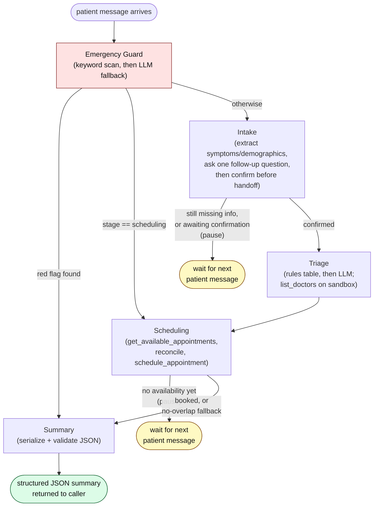
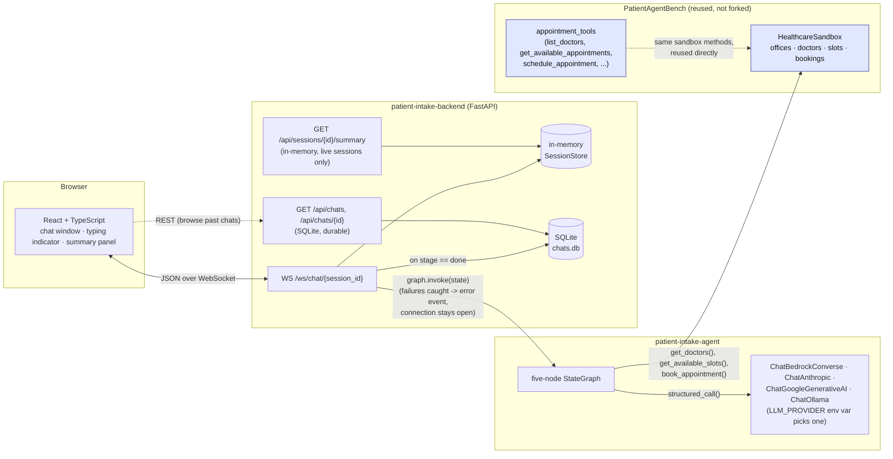

# Architecture

Two views: the five-node graph itself, and how the whole application wraps
around PatientAgentBench. A print-ready PDF of this page (for the
assignment's separate "architecture diagram" deliverable) is at
[`architecture.pdf`](architecture.pdf) in this same directory.

## The five-node graph

Compiled by `agent/src/patient_intake_agent/graph.py::build_graph()`. No
cycles, no checkpointer — invoked once per incoming patient message (see
[Conversation flow](../README.md#conversation-flow) in the root README).
Emergency Guard is the actual entry point, not Intake — see the "why" in the
[Architecture](../README.md#architecture) section of the root README.

Two things this diagram makes visible that the assignment's own linear
diagram (`Intake → Emergency Guard → Triage → Scheduling → Summary`)
doesn't: Emergency Guard sits on *every* path, including a direct route from
mid-scheduling straight to Summary; and only two nodes (Intake, Scheduling)
ever pause for another patient message — Triage always completes in the
same turn as whatever handed control to it. Intake's pause covers two
different sub-states now (still gathering, or reciting a confirmation
recap and waiting on a yes/correction) — both look identical to the graph
itself (`stage` stays `"intake"`), the distinction lives inside the node.

## How the application wraps PatientAgentBench

The two PatientAgentBench boxes (blue) are literally imported, not
reimplemented — `agent/src/patient_intake_agent/sandbox_setup.py` builds a
real `HealthcareSandbox` and Triage/Scheduling call its methods
(`get_doctors`, `get_available_slots`, `book_appointment`) directly, the same
methods PatientAgentBench's own `appointment_tools.py` calls internally. See
[`docs/exploration/patientagentbench-notes.md`](exploration/patientagentbench-notes.md)
for the full reused-vs-built breakdown.

Two data stores, on purpose, not one merged into the other: `SessionStore`
is fast, in-memory, and only ever holds *live* conversations — gone on
restart. `chats.db` (SQLite) is the durable record, written exactly once per
session, the moment it reaches `stage == "done"` (see `backend/README.md`).

A `graph.invoke()` failure — a provider rate limit, a transient server
error, a timeout, none of which are within this app's control — is caught
per-turn in the WebSocket handler and reported to the browser as a visible,
in-transcript error message rather than left to kill the connection
silently.
